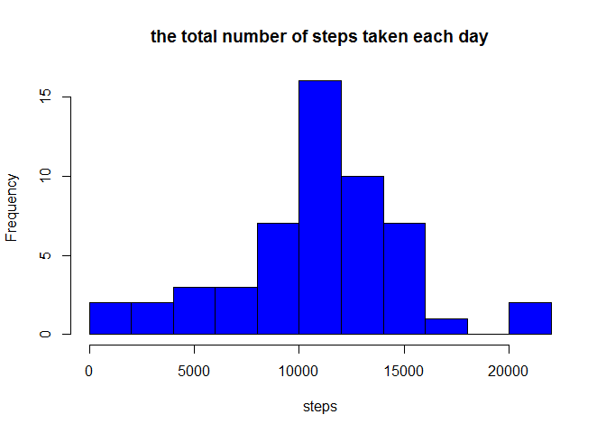
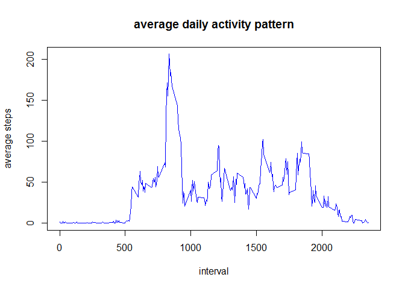
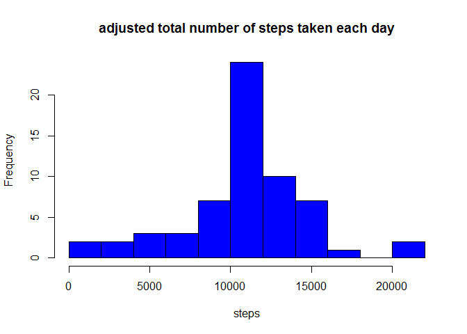
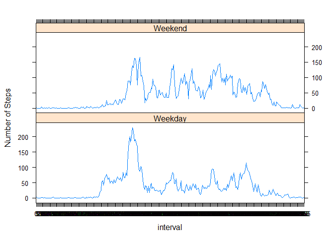

# Reproducible Research: Peer Assessment 1


## Loading and preprocessing the data

1. Load the data


```r
unzip("activity.zip")
data <- read.csv("activity.csv", header = TRUE, sep = ",", na.strings = "NA")
head(data)
```

```
##   steps       date interval
## 1    NA 2012-10-01        0
## 2    NA 2012-10-01        5
## 3    NA 2012-10-01       10
## 4    NA 2012-10-01       15
## 5    NA 2012-10-01       20
## 6    NA 2012-10-01       25
```

2. Process the format


```r
data$date <- as.Date(data$date, format = "%Y-%m-%d")
data$interval <- factor(data$interval)
```

## What is mean total number of steps taken per day?

1. Calculate the total number of steps taken per day.


```r
#ignore missing values
clean_before <- is.na(as.character(data$steps))
clean_data <- data[!clean_before,]
#aggregate steps per day
step_per_day <- aggregate(steps ~ date, data = clean_data, sum)
colnames(step_per_day) <- c("date", "steps")
```

2. Make a histogram of the total number of steps taken each day


```r
hist(as.numeric(step_per_day$steps), breaks = 10, col = "blue", xlab="steps", main = "the total number of steps taken each day")
```

 

3. Calculate and report the mean and median of the total number of steps taken per day


```r
#mean
mean(step_per_day$steps)
```

```
## [1] 10766.19
```

```r
#median
median(step_per_day$steps)
```

```
## [1] 10765
```

## What is the average daily activity pattern?

1. Make a time series plot


```r
#Calculating
average_interval <- aggregate(clean_data$steps, by=list(interval=clean_data$interval), FUN=mean)
colnames(average_interval) <- c("interval", "average_steps")

#Ploting
plot(as.integer(levels(average_interval$interval)), average_interval$average_steps, type="l", xlab="interval", ylab="average steps", main = "average daily activity pattern", col="blue")
```

 

2. Which 5-minute interval contains the maximum number of steps?


```r
max_interval <- average_interval[which.max(average_interval$average_steps),]$interval

max_interval
```

```
## [1] 835
## 288 Levels: 0 5 10 15 20 25 30 35 40 45 50 55 100 105 110 115 120 ... 2355
```

## Imputing missing values


1. Calculate and report the total number of missing values in the dataset 


```r
sum(is.na(as.character(data$steps)))
```

```
## [1] 2304
```

2. Filling in all of the missing values by the mean of that 5-minute interval.


```r
NA_index <- which(is.na(as.character(data$steps)))
complete_data <- data
complete_data[NA_index, ]$steps <- unlist(lapply(NA_index, FUN=function(NA_index){
    average_interval[data[NA_index,]$interval==average_interval$interval, ]$average_steps
}))
```

3. Create a new dataset that is equal to the original dataset but with the missing data filled in.


```r
#see step 2
head(complete_data)
```

```
##       steps       date interval
## 1 1.7169811 2012-10-01        0
## 2 0.3396226 2012-10-01        5
## 3 0.1320755 2012-10-01       10
## 4 0.1509434 2012-10-01       15
## 5 0.0754717 2012-10-01       20
## 6 2.0943396 2012-10-01       25
```

4. Make a histogram of the total number of steps taken each day and Calculate and report the mean and median total number of steps taken per day. Do these values differ from the estimates from the first part of the assignment? What is the impact of imputing missing data on the estimates of the total daily number of steps?


```r
steps_complete <- aggregate(steps ~ date, data = complete_data, sum)
colnames(steps_complete) <- c("date", "steps")
hist(as.numeric(steps_complete$steps), breaks = 10, col = "blue", xlab = "steps", main = "adjusted total number of steps taken each day")
```

 

```r
#Mean
mean(steps_complete$steps)
```

```
## [1] 10766.19
```

```r
#Median
median(steps_complete$steps)
```

```
## [1] 10766.19
```

## Are there differences in activity patterns between weekdays and weekends?

1. Create a new factor variable in the dataset with two levels - "weekday" and "weekend" indicating whether a given date is a weekday or weekend day.


```r
complete_data$day <- as.factor(weekdays(complete_data$date))
complete_data$is_weekday <- ifelse(!(complete_data$day %in% c("Saturday","Sunday")), TRUE, FALSE)
```

2. Make a panel plot containing a time series plot of the 5-minute interval and the average number of steps taken, averaged across all weekday days or weekend days.


```r
weekdays_data <- complete_data[complete_data$is_weekday,]
steps_per_interval_weekdays <- aggregate(weekdays_data$steps, by=list(interval=weekdays_data$interval), FUN=mean)
weekends_data <- complete_data[!complete_data$is_weekday,]
steps_per_interval_weekends <- aggregate(weekends_data$steps, by=list(interval=weekends_data$interval), FUN=mean)
colnames(steps_per_interval_weekdays) <- c("interval", "average_steps")
colnames(steps_per_interval_weekends) <- c("interval", "average_steps")
steps_per_interval_weekdays$day <- "Weekday"
steps_per_interval_weekends$day <- "Weekend"
week_data <- rbind(steps_per_interval_weekends, steps_per_interval_weekdays)
week_data$day <- as.factor(week_data$day)
library(lattice)
xyplot(average_steps ~  interval | day, data = week_data, layout = c(1,2), type ="l", ylab="Number of Steps")
```

 


